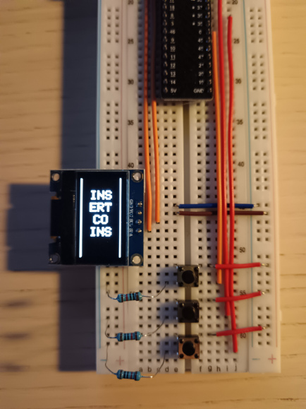
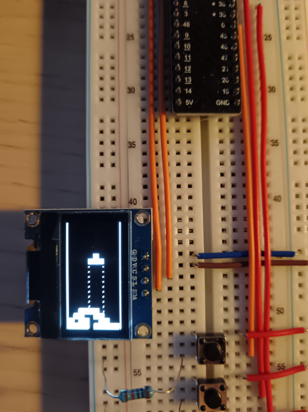
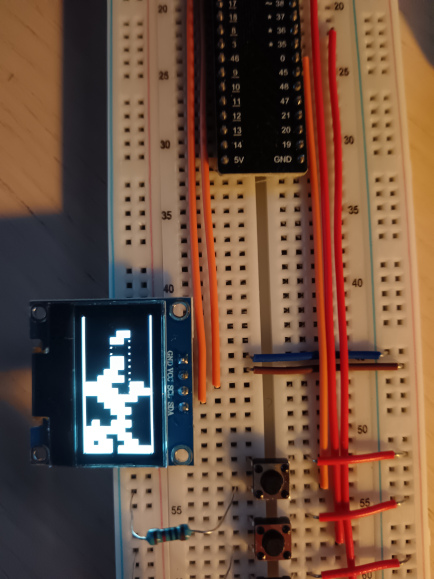
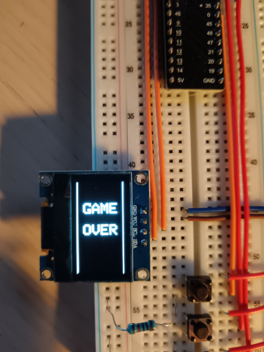
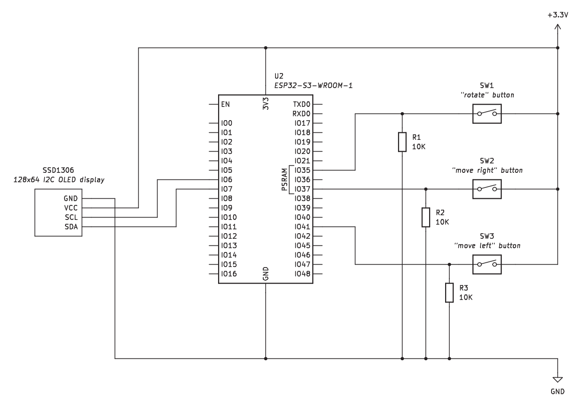

# Tetris game for ESP32

This project is a minimalist implementation of the Tetris game for the ESP32 platform.
It has been developed as an exercise to get a grasp of the following fundamentals:

* FreeRTOS tasks and event groups (used to control the hardware buttons)
* I2C communication (used to display the game graphics on an SSD1306 display)
* VSCode / PlatformIO development cycle
* hardware debugging

Here are some pictures of the working prototype:

## Electrical diagram

The electrical diagram is very simple:

## Requirements

* VSCode and PlatformIO installed
* Compatible hardware (Freenove ESP32-S3-WROOM-1 or equivalent)
* Display module (SSD1306 driver, 128x64 pixel resolution)
* Three mechanical switches
* Three 10K&#8486; resistors

## Todo

* Score, game level
* Music

## License

This project is licensed under the MIT License. See the [LICENSE](LICENSE.txt) file for details.